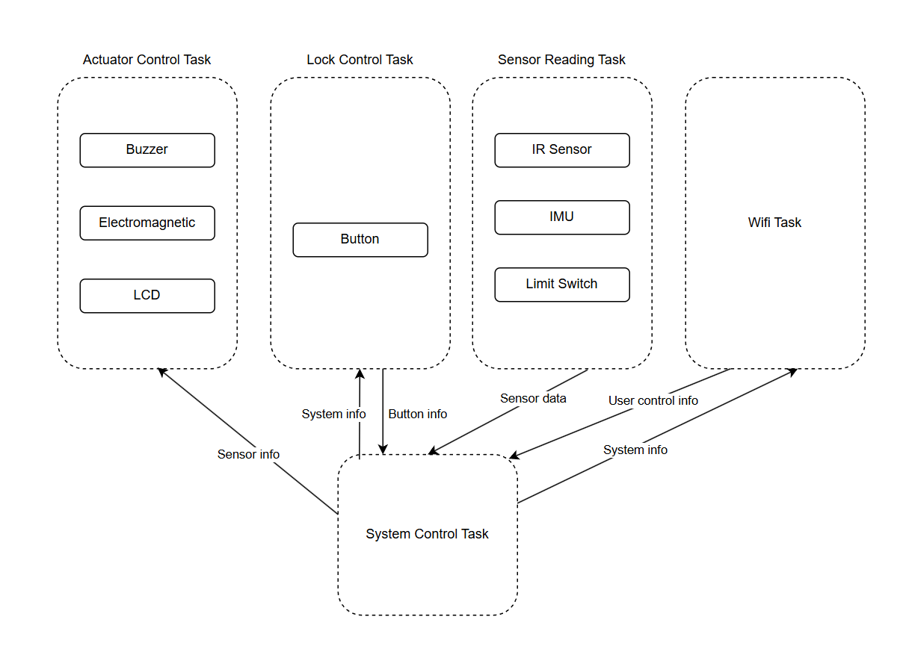
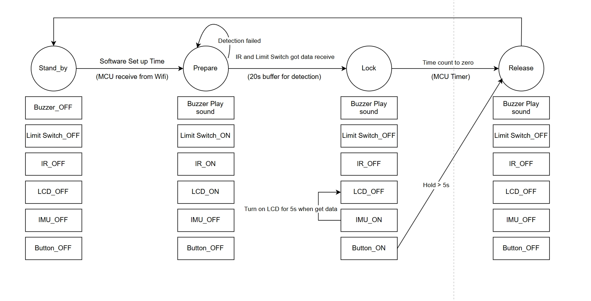
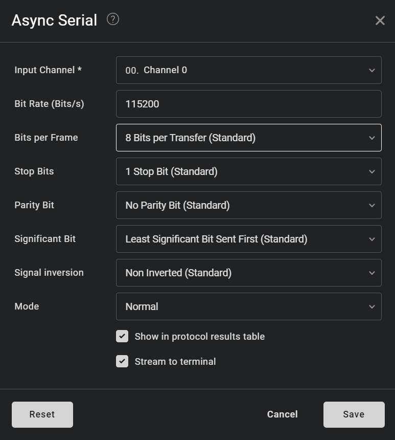
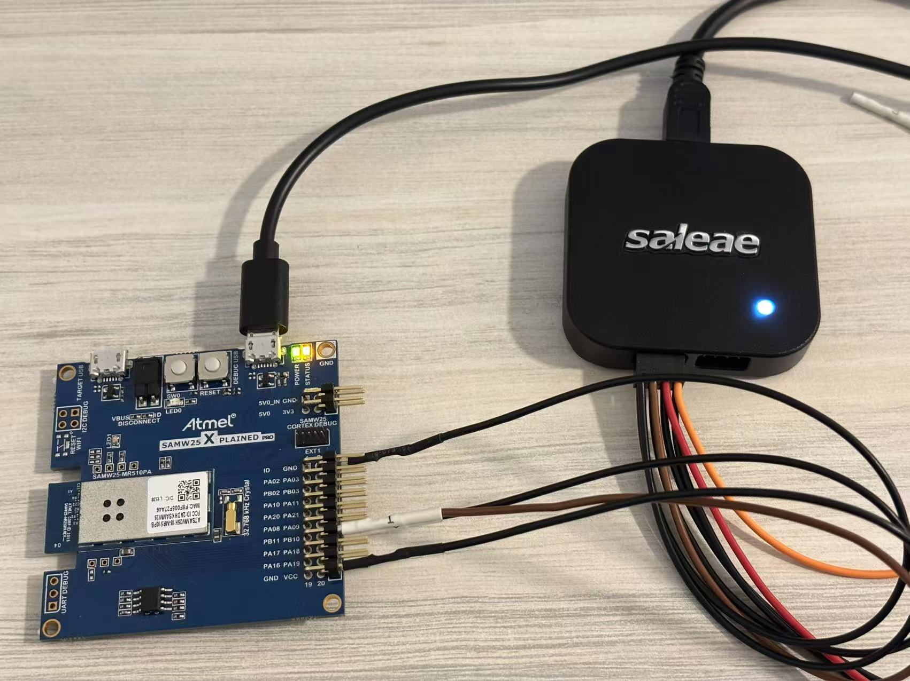
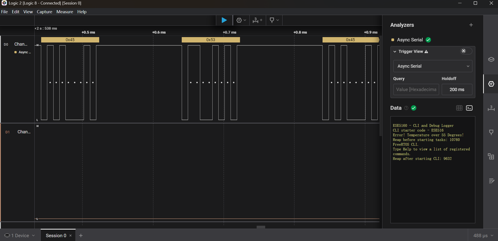

# a07g-exploring-the-CLI

* Team Number: 4
* Team Name: Crazy Thursday
* Team Members: Zheyu Li, Zhuozi Xie
* GitHub Repository URL: https://github.com/ese5160/final-project-a07g-a14g-t04-crazy-thursday.git
* Description of test hardware: (development boards, sensors, actuators, laptop + OS, etc)

## 1. Software Architecture

### 1.1 HRS

#### 1.1.1 Overview

The device includes an infrared sensor and a limit switch that cross-verifies that a cell phone has been placed in it, which activates a locking mechanism actuated by an electromagnet.The user can set the timer through mobile phone using WiFi connection. An emergency release button on the bottom of the device allows unlocking in urgent cases. For user interaction, a LCD screen on the surface should be used to display remaining time and a buzzer which can play music is used for indicating the time up. The device should balance the accesibility and energy consumption.

#### 1.1.2 Definitions, Abbreviations

IR sensor: infrared sensor

#### 1.1.3 Functionality

HRS 01 – Project shall be based on SAM W25 microcontroller (WiFi supported).

HRS 02 – An IR sensor(via I2C) shall be used for phone detection. The sensor shall be able to accurately detect distances in the range of 1-10cm.

HRS 03 – An 5V DC electromagnet with at least 2.5kg holding force shall be used to support the lock mechanism.

HRS 04 – An LCD display shall be used for user interface. The display shall communicate with the microcontroller via SPI.

HRS 05 – A passive buzzer that releases sounds of different frequencies shall be used.

HRS 06 - A Li-Ion battery (3.7V nominal voltage) Shall be used as the power supply of the whole system.

HRS 07 - A limit switch shall be used with IR sensor to cross validate that the cell phone is placed in the box

HRS 08 - A 6-DOF IMU supporting I2C connection shall be used to detect whether the box has been moved or not，>10Hz sample rate is enough.

### 1.2 SRS

#### 1.2.1 Overview

The Pandora's Box is a box that follow the scheduled study plan on the app, or set manually by user through cell phone, to lock phone and open after time out. Using a timed lock mechanism, it securely stores your phone, encouraging focus and productivity.

An electromagnet work as the locker of the box, prevent violent opening. A Infrared sensor with a limit switch check is the phone really in the box instead a empty box. There is also a LCD screen on the top of the box, which shows the time remaning for current study session.  An emergency button locate at the buttom of the box used to release lock in urgent conditions. A buzzer is in the box to help inform the user for study begin and end. There is an app, communicate through WIFI, that your can build you study plan and goals or use to set study time manually.

#### 1.2.2 Users

This project is for students seeking to build better learning habits, which could force them to focus on study without any disturb from phone.

#### 1.2.3 Functionality

SRS 01 – The IR sensor and limit switch shall continuously detect the presence of objects inside the box when the time is set and before the box is closed(in Prepare Stage).

SRS 02 - The Device shall receive commands from mobile phones using WiFi.

SRS 03 - The box shall support setting study time using mobile phone (based on WiFi connection).

SRS 04 - The electromagnet shall be controlled according to the status of IR sensor, limit switch and emergency release button.

SRS 05 - The buzzer should play sound to inform the user to study when reaching the scheduled study time.

SRS 06 - The buzzer should play sound to inform the user to rest when the setting time period end.

SRS 07 - IMU's reading should determine the LCD on/off based on the box gesture during lock state.

### 1.3 Block Diagram (task division)

### 1.4 State machine diagrams

## 2. Understanding the Starter Code

### 2.1 What does “InitializeSerialConsole()” do? In said function, what is “cbufRx” and “cbufTx”? What type of data structure is it?

Initializes the UART - sets up the SERCOM to act as UART and registers the callbacks for asynchronous reads and writes.

cbufRx and cbufTx are ring buffers to store received characters and characters to be sent.

The type is **cbuf_handle_t**, which is a pointer to circular buffer structure.

### 2.2 How are “cbufRx” and “cbufTx” initialized? Where is the library that defines them (please list the *C file they come from)

Use function **circular_buf_init**. From the library **circular_buffer.c** & **circular_buffer.h**.

### 2.3 Where are the character arrays where the RX and TX characters are being stored at the end? Please mention their name and size. Tip: Please note cBufRx and cBufTx are structures

rxCharacterBuffer and txCharacterBuffer. Both of theri size are 512 bytes.

### 2.4 Where are the interrupts for UART character received and UART character sent defined?

In function **configure_usart_callbacks**.

### 2.5 What are the callback functions that are called when

- A character is received: **usart_read_callback**.

- A character has been sent: **usart_write_callback**.

### 2.6 Explain what is being done on each of these two callbacks and how they relate to the cbufRx and cbufTx buffers

**usart_read_callback**:

This function is triggered when receiving a character. The received character should be stored in **cbufRx**  for later retrieval. The function then restart the UART receive job to keep continuously reading incoming characters.

**usart_write_callback**:

This function is triggered when finishing transmitting a character. It checks if there are more characters in **cbufTx** waiting to be sent. If characters remain, it fetches the next character from cbufTx and sends it via UART.

### 2.7 Draw a diagram that explains the program flow for UART receive – starting with the user typing a character and ending with how that characters ends up in the circular buffer “cbufRx”. Please make reference to specific functions in the starter code

### 2.8 Draw a diagram that explains the program flow for the UART transmission – starting from a string added by the program to the circular buffer “cbufTx” and ending on characters being shown on the screen of a PC (On Teraterm, for example). Please make reference to specific functions in the starter code

### 2.9 What is done on the function “startTasks()” in main.c? How many threads are started?

Calls xTaskCreate() to create the CLI task and logs the FreeRTOS heap size before & after task creation.

In starter code, only one threads are started(CLI Task).

#### 3.Debug Logger Module

Preview of the code:

    /**
    * @brief Logs a message at the specified debug level.
    */
    void LogMessage(enum eDebugLogLevels level, const char *format, ...)
    {
        if ((level > currentDebugLevel) || (level == currentDebugLevel)){
            char buffer[TX_BUFFER_SIZE];

            va_list args;
            va_start(args, format);
            vsprintf(buffer, format, args);
            va_end(args);
            SerialConsoleWriteString(buffer);
        }
    }

#### 4. Wiretap the convo

#### 4.1 Short anwsers

- What nets must you attach the logic analyzer to?

    SERCOM4 PAD2 and PAD3.

- Where on the circuit board can you attach / solder to?

    PB10(TX), PB11(RX), GND

- What are critical settings for the logic analyzer?

    Use asynchronous serial mode and set bitrate as 115200 and input channel to be D0(PB10)
    

### 4.2 Hardware connections between the SAMW25 Xplained dev board and the logic analyzer

### 4.3 Screenshot of the decoded message

### 4.4 Capture file (i.e., the .sal file) of a wiretapped conversation

The log file is saved in the repo as A07G/decodedMessage.sal

## 5. Complete the CLI

Preview of the code:

    /**************************************************************************/ 
    /**
    * @fn			void usart_read_callback(struct usart_module *const usart_module)
    * @brief		Callback called when the system finishes receives all the bytes requested from a UART read job
    * @note
    *****************************************************************************/
    void usart_read_callback(struct usart_module *const usart_module)
    {
        BaseType_t xHigherPriorityTaskWoken = pdFALSE;

        // Attempt to put received character into the circular buffer
    if (circular_buf_put2(cbufRx, latestRx) == 0)
        {
            // Notify the CLI task that new data is available
            xSemaphoreGiveFromISR(xCliSemaphore, &xHigherPriorityTaskWoken);
        }
        else
        {
            SerialConsoleWriteString("UART Read Buffer is full.\r\n");// Buffer full, data is lost (a debug log here)
        }

        // Restart USART read job
        usart_read_buffer_job(&usart_instance, (uint8_t *)&latestRx, 1);

        // Yield if a higher-priority task should run
        portYIELD_FROM_ISR(xHigherPriorityTaskWoken);
    }

    /**************************************************************************/
    * @fn			void FreeRTOS_read(char* character)
    * @brief		This function block the thread unless we received a character.
    * @details		
    * @note
    *****************************************************************************/
    extern SemaphoreHandle_t xCliSemaphore;
    extern cbuf_handle_t cbufRx;

    static void FreeRTOS_read(char *character)
    {
        uint8_t c;
        xSemaphoreTake(xCliSemaphore, portMAX_DELAY);

        // Get data from circular buffer
        if (circular_buf_get(cbufRx, &c) == 0)
        {
            *character = (char)c;  // Successfully retrieved character
        }
        else
        {
            *character = '\0';  // Should not happen, but safety check
        }
        
    }

## 6. Add CLI commands

### 6.1 Functioning CLI code

    // Version command
    static const CLI_Command_Definition_t xVersionCommand = 
        {
            "version",
            "version: Prints the current firmware version\r\n",
            CLI_GetVersion,
            0};

    // Ticks command
    static const CLI_Command_Definition_t xTicksCommand = 
        {
            "ticks",
            "ticks: Prints the number of ticks since the scheduler was started\r\n",
            CLI_GetTicksNumber,
            0};

### 6.2 Video of CLI Test

Link to the video: https://drive.google.com/file/d/1xVJVlHg0vayqH7xe8IqdoaMNttBXHMuA/view?usp=sharing